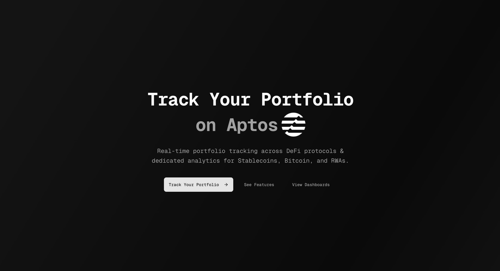
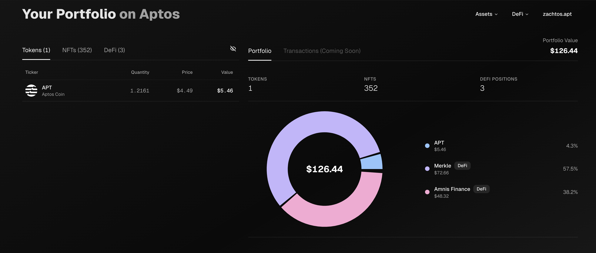
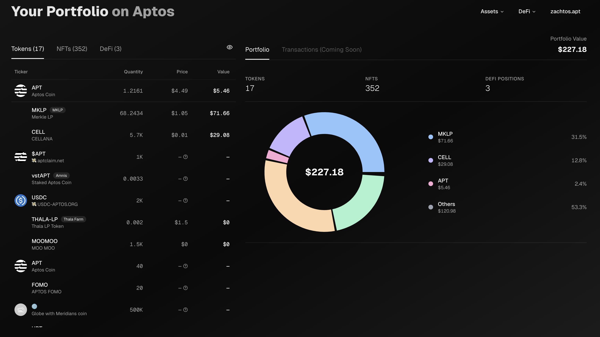
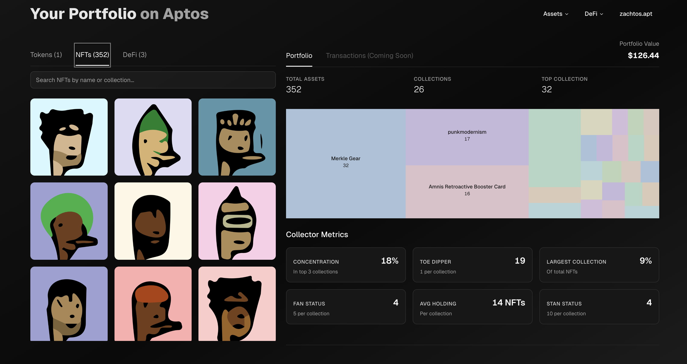
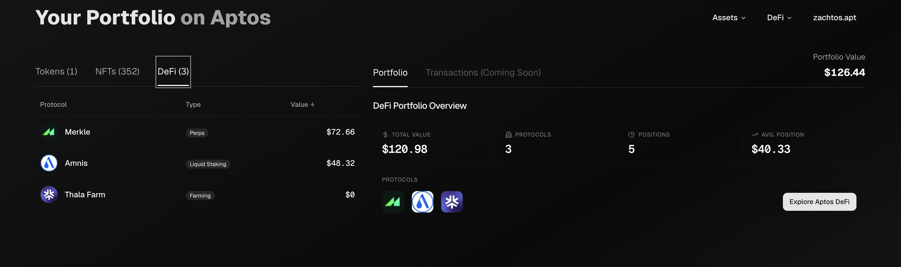
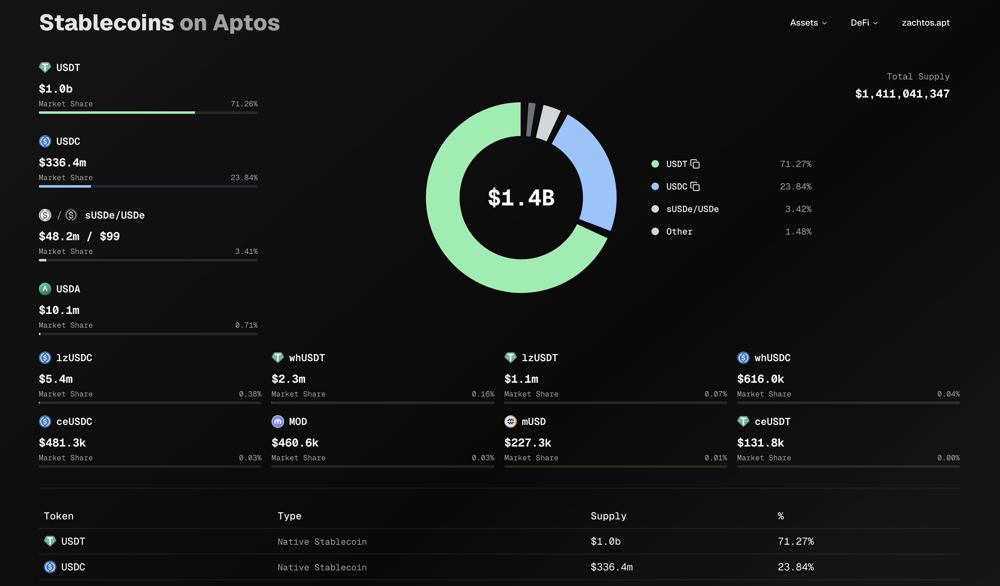
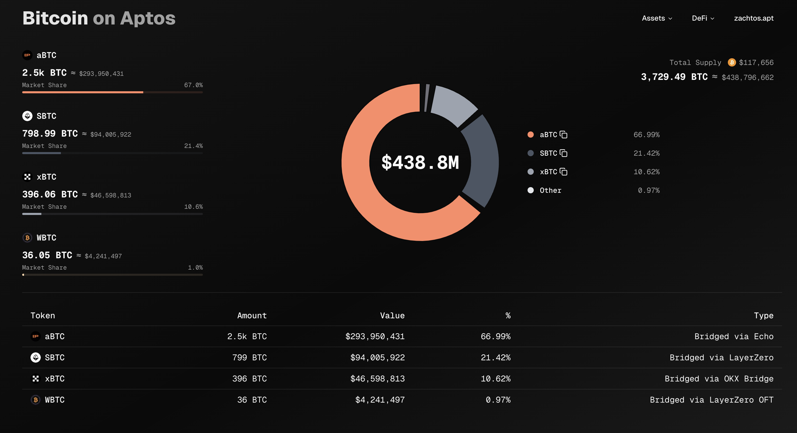
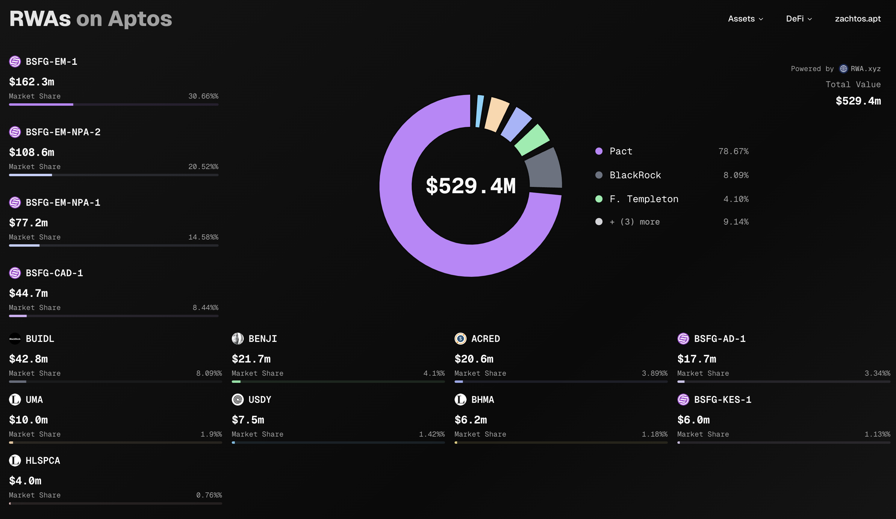
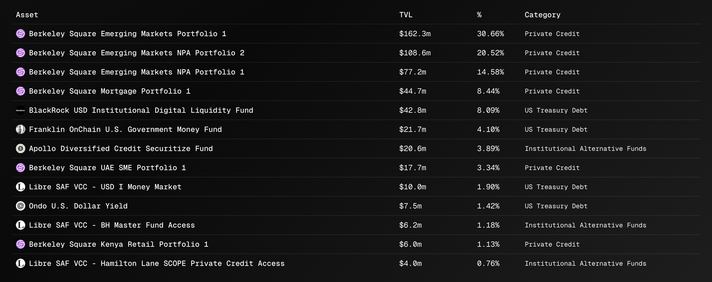
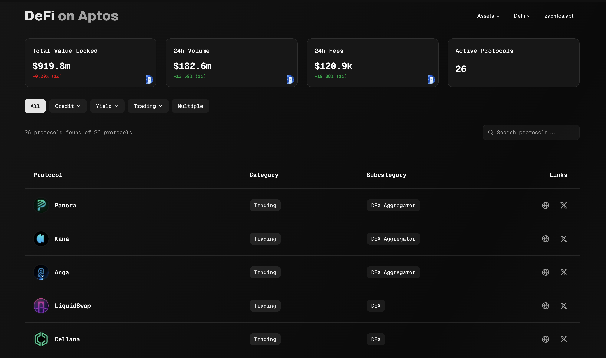

# On Aptos

On Aptos is a public good for the Aptos ecosystem that offers multiple specialized dashboards and analytics tools:

- **Portfolio Tracker** - Complete wallet analytics including token balances, NFT collections, and DeFi positions
- **Stablecoins Dashboard** - Track stablecoin metrics for 12 different single stablecoins on Aptos
- **Bitcoin on Aptos** - Monitor Bitcoin activity and cross-chain movements - aBTC, xBTC, WBTC, & SBTC
- **Real-World Assets (RWAs)** - Analytics for tokenized real-world assets on Aptos via RWA.xyz
- **DeFi Analytics** - Comprehensive list of mainnet protocols with aggregated TVL, fee, and volume tracking

## Screenshots



### Portfolio Tracker





### Analytics Dashboards






## Tech Stack

- **Frontend**: Next.js 14, React, TypeScript
- **Styling**: Tailwind CSS, Shadcn/ui components
- **Data Sources**: 
  - Aptos Indexer GraphQL API
  - Panora Token List & Price API
  - CoinMarketCap API
  - RWA.xyz data endpoints
- **State Management**: React Context + Hooks
- **Charts**: Recharts for data visualization
- **Logging**: Pino logger for structured logging

## Architecture

### Frontend Architecture
- **App Router**: Next.js 14 App Router for server components and improved performance
- **Component Structure**: 
  - `/components/pages/*` - Page-specific components organized by feature
  - `/components/layout/*` - Shared layout components (Header, Footer, ThemeProvider)
  - `/components/ui/*` - Reusable UI components from shadcn/ui
- **Custom Hooks**: Feature-specific hooks in `/hooks` for data fetching and state management
- **Type Safety**: Full TypeScript coverage with strict type checking

### Backend Architecture
- **API Routes**: RESTful endpoints in `/app/api/*` organized by feature
- **Service Layer**: `/lib/services/*` contains business logic separated from API routes
- **Data Aggregation**: Portfolio batch API aggregates multiple data sources in parallel
- **Error Boundaries**: Graceful error handling at both API and component levels

### Data Flow
1. **Client Request**: User navigates to portfolio page
2. **Batch API Call**: Single request to `/api/portfolio/batch`
3. **Parallel Fetching**: Server fetches assets, DeFi, and NFTs simultaneously
4. **Response Aggregation**: Data combined and cached before sending to client
5. **Progressive Rendering**: UI updates as each data type becomes available

### Key Services
- **AssetService**: Handles token balances and price aggregation
- **NFTService**: Manages NFT fetching with pagination and collection statistics
- **DeFiService**: Aggregates positions across multiple protocols
- **PanoraService**: Interfaces with Panora API for token metadata and prices

## Environment Variables

All environment variables must be configured for full functionality:

### Client and Server Variable Details

- **`NEXT_PUBLIC_SITE_URL`**: The URL where your application is hosted
- **`NEXT_PUBLIC_CORS_ORIGINS`**: Comma-separated list of allowed CORS origins
- **`NODE_ENV`**: Set to `development` for local development or `production` for deployment
- **`CMC_API_KEY`**: Required for fetching cryptocurrency market data and prices
- **`RWA_API_KEY`**: Enables access to real-world asset tokenization data
- **`APTOS_BUILD_SECRET`**: Authentication token for Aptos Indexer GraphQL API (prevents rate limiting)
- **`PANORA_API_KEY`**: Access to Panora's comprehensive price feeds

### Logging System

The project uses Pino logger for structured logging with different log levels:

```typescript
import { logger, apiLogger, serviceLogger } from '@/lib/utils/logger'

// Use appropriate loggers for different contexts
apiLogger.info('API request received')       // API route logging
serviceLogger.debug('Processing data')       // Service layer logging
logger.error('An error occurred', error)     // General error logging
```

**Log Levels**:
- `debug`: Detailed information for debugging (development only)
- `info`: General informational messages
- `warn`: Warning messages for potential issues
- `error`: Error messages with stack traces

**Important**: Never use `console.log()` - the CI pipeline will fail

## Performance Metrics

### Load Time Optimizations
- **Initial Load**: ~1.2s for portfolio assets (highest priority)
- **Full Load**: ~3-5s for complete portfolio including NFTs
- **Subsequent Loads**: <500ms with caching

### Bundle Size Optimization
- **Code Splitting**: Dynamic imports for heavy components
- **Tree Shaking**: Unused code eliminated in production
- **Image Optimization**: Next.js Image component with lazy loading
- **Translation Splitting**: Only active language loaded

### API Performance
- **Batch Endpoint**: Reduces 3+ serial requests to 1 parallel request
- **GraphQL Optimization**: Specific field selection to minimize payload
- **Pagination**: NFTs loaded in batches of 50 to prevent timeout
- **Connection Pooling**: Reused connections for GraphQL queries

## Security

### API Security
- **Environment Variables**: All sensitive data stored in `.env.local`
- **CORS Configuration**: Strict origin validation for API endpoints
- **Rate Limiting**: Built-in protection against API abuse
- **Input Validation**: All user inputs sanitized before processing

### Authentication
- **Aptos Indexer**: Bearer token authentication for better rate limits
- **API Keys**: Separate keys for each external service
- **No Client Secrets**: All sensitive operations server-side only

### Best Practices
- **No Console Logs**: Pino logger for production-safe logging
- **Error Sanitization**: Sensitive data removed from error messages
- **Dependency Scanning**: Regular updates and vulnerability checks
- **Type Safety**: TypeScript prevents common security issues

## Features

### Internationalization (i18n)
- **12 Languages Supported**: English, Spanish, Arabic, German, French, Hausa, Hindi, Japanese, Korean, Portuguese, Russian, and Chinese
- **Lazy Loading**: Translations are loaded on-demand using `i18next-http-backend` to reduce initial bundle size
- **RTL Support**: Automatic right-to-left layout for Arabic language
- **Smart Language Detection**: Automatically detects user's browser language with fallback to English
- **Namespace Organization**: Translations are organized by feature (common, defi, rwas, stables, btc) for better maintainability
- **Server-Side Rendering**: English translations are pre-loaded for optimal SSR performance

### Theme System
- **Light/Dark Mode**: Full theme support with system preference detection
- **Persistent Preference**: Theme choice is saved to localStorage and persists across sessions
- **Next-Themes Integration**: Uses `next-themes` for flicker-free theme switching
- **Tailwind CSS**: Dark mode variants for all components using Tailwind's dark: prefix
- **System Theme**: Respects user's OS theme preference by default

### Performance Optimizations

#### Portfolio Page Loading Strategy
- **Batch API**: Single `/api/portfolio/batch` endpoint reduces API calls from 3+ to 1
- **Progressive Loading**: Assets load first (highest priority), followed by DeFi positions, then NFTs
- **Staggered Fetching**: 200ms delay for DeFi, 500ms for NFTs to prevent API overload
- **Smart NFT Loading**: Initial batch of 50 NFTs with lazy loading for additional items
- **Collection Statistics**: Pre-calculated NFT collection stats delivered with batch response

#### Caching Strategy
- **5-Minute Cache**: Token prices cached using SimpleCache utility
- **CDN Cache Headers**: `Cache-Control: public, s-maxage=300, stale-while-revalidate=600`
- **Request Deduplication**: Prevents duplicate API calls for the same data
- **Stale-While-Revalidate**: Serves cached content while fetching updates in background

#### API Rate Limiting Protection
- **Exponential Backoff**: Automatic retry with delays: 1s, 2s, 4s, 8s, 16s, 32s
- **Enhanced Fetch**: Custom fetch wrapper with built-in retry logic
- **Graceful Degradation**: Returns cached or default values on API failures
- **Promise.allSettled**: Prevents one API failure from breaking entire data fetch

## License

This project is licensed under the MIT License - see the [LICENSE](LICENSE) file for details.

## Acknowledgments

- Aptos for the blockchain infrastructure
- Panora for their token list and price APIs
- The Aptos community for feedback and support
